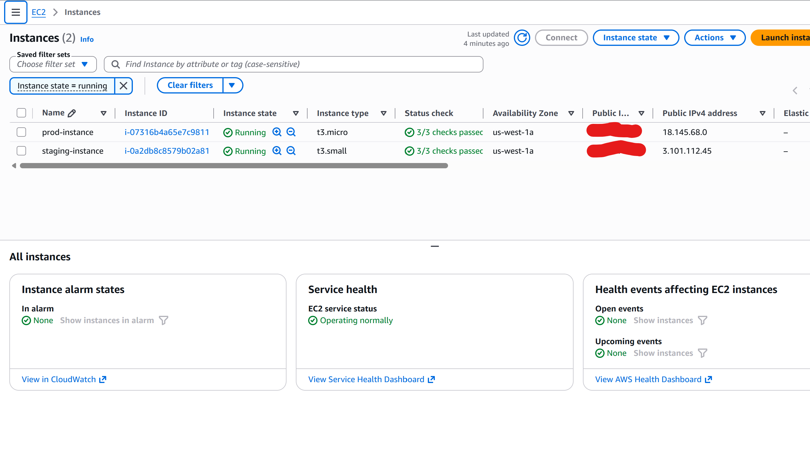

# Multi-Environment Infrastructure Platform

Production-ready AWS infrastructure deployed with Terraform across staging and production environments.

## Features

✅ **Multi-Environment Setup** — Staging (t3.small) and Production (t3.micro) with independent state  
✅ **Infrastructure as Code** — Terraform-managed VPC, subnets, security groups, EC2 instances  
✅ **Isolated State** — Terraform workspaces for environment isolation  
✅ **Production-Grade Networking** — Public/private subnets, internet gateway, route tables  
✅ **Security Groups** — Network segmentation with SSH access configured  
✅ **Resource Tagging** — All resources tagged for cost tracking and management  

## Quick Start

```bash
cd terraform

# Deploy to staging
terraform workspace select staging
terraform apply -var-file="environments/staging/terraform.tfvars"

# Deploy to production
terraform workspace select prod
terraform apply -var-file="environments/prod/terraform.tfvars"
```

## Deployed Environments



## Architecture

- **Staging**: t3.small EC2 instance in dedicated VPC (10.0.0.0/16)
- **Production**: t3.micro EC2 instance in dedicated VPC (10.0.0.0/16)
- Each environment has independent security groups, subnets, and internet connectivity

## Environment Details

| Environment | Instance Type | VPC CIDR | Status |
|-------------|---------------|---------|--------|
| Staging | t3.small | 10.0.0.0/16 | ✅ Deployed |
| Production | t3.micro | 10.0.0.0/16 | ✅ Deployed |

## Tech Stack

- **IaC**: Terraform
- **Cloud**: AWS (us-west-1)
- **Compute**: EC2
- **Networking**: VPC, Subnets, Security Groups, Internet Gateway

## Learning Resources

See `docs/` for architecture diagrams and deployment guides.